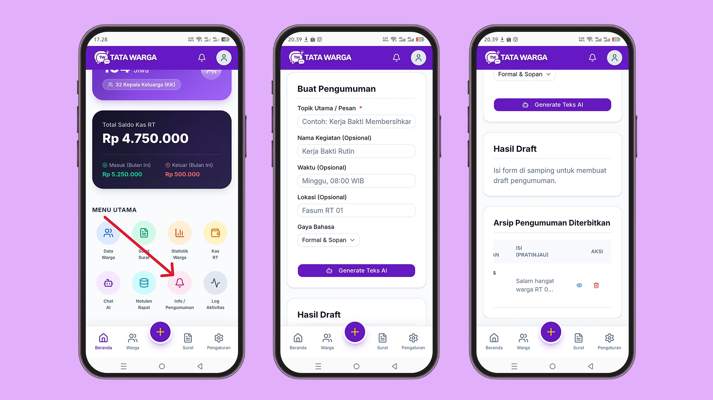

# Buat Broadcast Pengumuman

Menyusun kalimat pengumuman yang pas (tidak terlalu kaku namun tetap sopan) seringkali memakan waktu. Melalui tab **Broadcast Pengumuman** di menu **Asisten AI**, Anda bisa membuat draf kalimat profesional hanya dalam hitungan detik.

## Langkah Membuat Pengumuman Otomatis
1. Masuk ke menu **Info/Pengumuman**,.
2. Anda akan dibawa ke halaman pembuatan pengumuman otomatis, isi formulir rancangan:
   *   **Topik Utama (Wajib):** Contoh: *Kerja Bakti Membersihkan Selokan*.
   *   **Nama Kegiatan:** Contoh: *Kerja Bakti Rutin*.
   *   **Waktu:** Contoh: *Minggu, 08:00 WIB*.
   *   **Lokasi:** Contoh: *Fasum RT 01*.
   *   **Gaya Bahasa:** Pilih nada tulisan yang Anda inginkan (*Formal & Sopan*, *Santai & Ramah*, *Tegas & Mendesak*, atau *Singkat & Padat*).
3. Klik tombol **"Generate Teks AI"**.

## Menggunakan Hasil Draft
Setelah AI selesai memproses, teks pengumuman yang rapi akan muncul di kolom kanan ("Hasil Draft"). Anda bebas untuk mengedit teks tersebut secara manual jika ada yang kurang pas.

Selanjutnya, Anda memiliki dua opsi:
*   **Salin WA:** Menyalin seluruh teks ke *clipboard* perangkat Anda, sehingga Anda bisa langsung menempelkannya (*paste*) di grup WhatsApp warga.
*   **Terbitkan di Dashboard:** Menyimpan draf tersebut sebagai pengumuman resmi di sistem Tata Warga, sehingga warga yang membuka aplikasi bisa membacanya di halaman muka (*dashboard*) mereka.

Seluruh pengumuman yang pernah Anda terbitkan akan tersimpan otomatis pada tabel **Arsip Pengumuman Diterbitkan** di bagian bawah, lengkap dengan fitur pratinjau (ikon mata) dan hapus (ikon tempat sampah).
