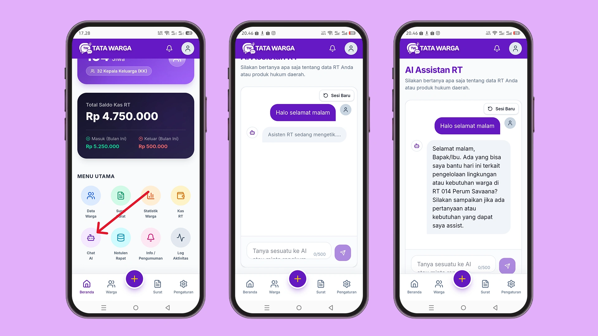

# Fitur Chat AI

Tata Warga dilengkapi dengan Asisten AI interaktif yang siap membantu pengurus RT kapan saja. Anda bisa berinteraksi dengannya selayaknya *chatting* dengan asisten pribadi yang pintar.

## Mengakses Chat AI
1. Masuk ke menu **Asisten AI** di *Dashboard*.
2. Secara *default*, Anda akan langsung berada di tab **Chat AI**.
3. Di bagian bawah layar, terdapat kolom untuk mengetikkan pertanyaan atau perintah Anda.

## Kemampuan Chat AI
Berbeda dengan chatbot biasa, Asisten AI di Tata Warga dibekali dengan kemampuan canggih:

*   **Tanya Jawab Seputar RT:** Anda bisa meminta saran, misalnya: *"Berikan ide lomba 17 Agustus yang hemat biaya"* atau *"Bagaimana cara menegur warga yang sering buang sampah sembarangan dengan sopan?"*.
*   **Merangkum Catatan:** Anda bisa menempelkan (*paste*) teks hasil obrolan panjang di grup warga dan meminta AI merangkum intinya.
*   **Mencari Produk Hukum Atau Nomor Darurat):** Ini adalah fitur yang paling canggih! Chat AI akan bertindah sebagai asisten RT dan sudah diekali dengan **Knowladeg Base**, artinya jika Anda bertanya tentang produk hukum atau Hotline Kabuaten Tangerang, AI Assistant akan memberikan inforamsi yang akurat.

Gunakan fitur ini untuk meringankan beban administratif dan mendapatkan sudut pandang obyektif dalam memecahkan masalah keseharian di lingkungan warga Anda.
