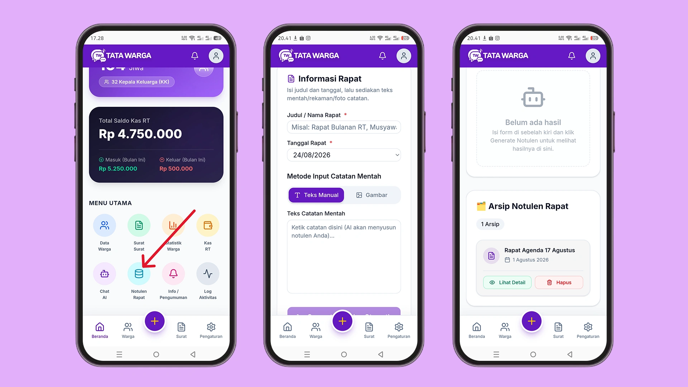

# Notulen Rapat AI

Jangan biarkan waktu Anda atau sekretaris RT habis hanya untuk menyusun kalimat baku hasil rapat bulanan. Fitur **Notulen AI** dirancang khusus untuk mengubah catatan mentah (tulisan acak, poin-poin singkat, atau bahkan coretan di kertas) menjadi notulen resmi yang sangat rapi.

## Cara Menggunakan Notulen Rapat AI
Fitur ini akan memudahkan Ketua RT untuk membuat notulen hasil rapat agar hasilnya bisa langsung di sebar ke warga.
1. Pilih menu **Notulen AI**.
2. Isi **Judul Rapat** (Misal: *Musyawarah Pembangunan Gapura*) dan **Tanggal Rapat**.
3. Pilih **Metode Input Catatan Mentah**. Kami menyediakan dua cara canggih:
   *   **Teks Manual:** Anda bisa mengetik langsung poin-poin acak dari hasil rapat Anda ke dalam kotak teks.
   *   **Gambar (Kamera/Foto):** Apakah Anda hanya memotret tulisan spidol di papan tulis saat rapat? Gunakan fitur ini! Unggah fotonya, dan AI (melalui teknologi OCR - *Optical Character Recognition*) akan mengekstrak tulisan di papan tulis tersebut menjadi teks digital secara otomatis.
4. Klik **"Generate Notulen Otomatis"**.

## Mengelola Hasil Notulen
Dalam beberapa detik, AI akan menstrukturkan poin-poin mentah Anda menjadi format notulen resmi yang berisi:
*   Agenda Rapat
*   Daftar Peserta
*   Hasil/Keputusan Rapat
*   Tindak Lanjut

Di kolom kanan (**Hasil Generate**), Anda bisa mengoreksi kalimat hasil kerja AI. Setelah dirasa sempurna, Anda bisa:
*   **Salin Teks (WhatsApp):** Mengkopi seluruh notulen untuk dilaporkan ke grup pengurus.
*   **Simpan ke Arsip:** Menyimpan dokumen tersebut secara permanen ke dalam database aplikasi.

Semua notulen yang tersimpan akan masuk ke dalam **Arsip Notulen Rapat** di bagian bawah halaman. Kapan pun Anda butuh melihat keputusan rapat bulan lalu, arsip digital Anda selalu siap diakses tanpa harus membongkar tumpukan kertas!
