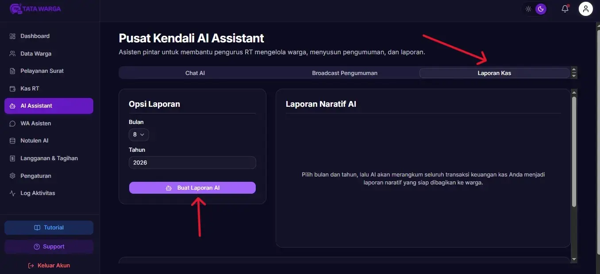

# Buat Laporan Kas dengan AI

Membuat laporan pertanggungjawaban keuangan setiap akhir bulan kepada warga kerap menjadi beban bagi pengurus RT (terutama Bendahara). 

Di Tata Warga, kami menyematkan **AI Assistant (Kecerdasan Buatan)** yang mampu menganalisis ratusan baris transaksi Anda selama sebulan, dan merangkumnya menjadi teks naratif/bacaan yang enak dibaca dan siap *di-publish*!

## Langkah Membuat Laporan Kas Cerdas

1. Masuk ke menu **Asisten AI** di *Dashboard* Anda.
2. Pada bagian atas (tab navigasi), pilih tab **"Laporan Kas"**.
3. Di sisi kiri layar (Opsi Laporan), pilih **Bulan** dan ketik **Tahun** laporan yang ingin Anda buat (Misal: Agustus 2026).
4. Klik tombol **"Buat Laporan AI"**.

Sistem akan membutuhkan waktu beberapa saat (memproses data dengan *AI Engine*). Setelah selesai, di kotak sebelah kanan akan muncul **Laporan Naratif AI**. 

Laporan ini bukan sekadar tabel angka kaku, melainkan dirangkai dalam bahasa naratif seperti: *"Selamat malam warga RT 01. Pada bulan Agustus ini, kas kita menerima pemasukan total sekian, dan ada beberapa pengeluaran utama untuk perbaikan jalan..."*

## Menerbitkan Laporan
Setelah draft selesai, Anda punya dua pilihan:
1. **Salin Laporan:** Tombol ini akan menyalin (copy) teks laporan. Anda bisa mem-*paste* nya langsung ke grup WhatsApp warga.
2. **Terbitkan di Dashboard:** Mengirimkan laporan tersebut menjadi **Pengumuman Resmi** di dalam sistem. Warga yang memiliki akses ke aplikasi (jika Anda membukanya untuk umum) bisa membacanya di kolom pengumuman.

Semua laporan dan draf yang telah diterbitkan akan tersimpan rapi di dalam tabel **Arsip Laporan Terbit** di bagian bawah halaman tersebut, lengkap dengan tombol pratinjau (mata) dan hapus (tong sampah).
