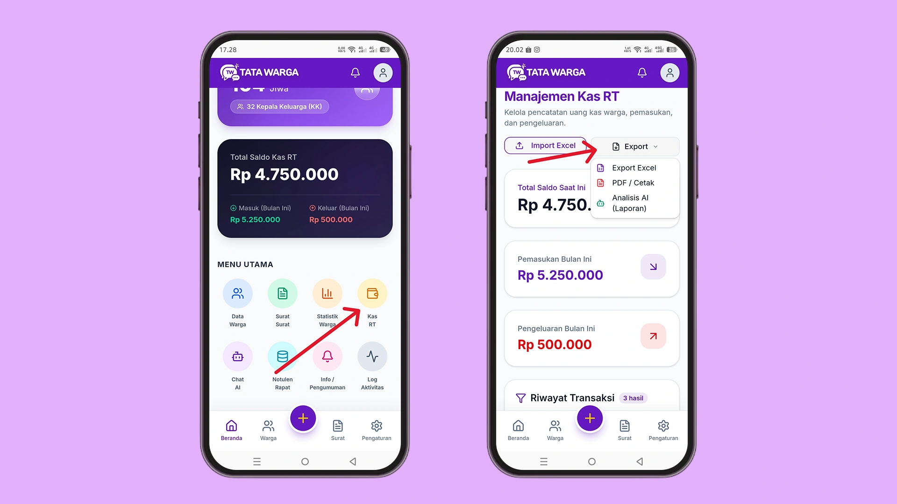

# Export Kas RT

Aplikasi Tata Warga menyediakan fitur pencadangan data mandiri (*backup*) melalui tombol **Export**. Fitur ini memungkinkan Anda menyimpan seluruh data warga dari sistem kembali ke dalam perangkat (komputer/laptop) Anda.

Untuk kebutuhan transparansi, pelaporan kepada warga dalam rapat bulanan, atau sekadar pencadangan data *offline*:
1. Buka Menu **Kas RT**.
2. Klik tombol **"Export"**.
3. Akan ada 3 pilihan export: 
- **Export Excel** yang dapat diedit;
- **PDF/Cetak** untuk laporan siap print; dan
- **Analisis AI** untuk membut lpaoran menggunakan AI yang bisa di share via whatsapp ke warga. 