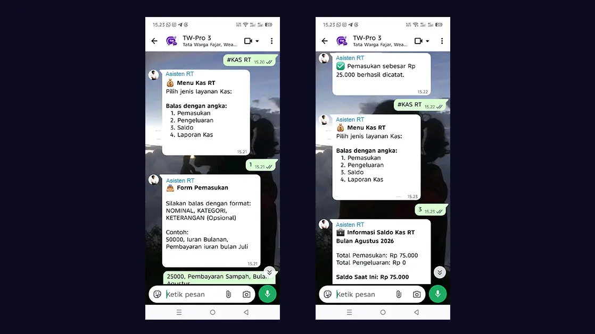

# Input Pemasukan & Pengeluaran Lewat WhatsApp

Sama seperti fitur Manajemen Warga dan Pelayanan Surat, Anda juga bisa mencatat keuangan RT langsung melalui obrolan grup WhatsApp! Fitur ini sangat bermanfaat jika Anda sedang berada di luar (misal: di toko bangunan saat membeli keperluan warga) dan ingin langsung mencatat pengeluaran saat itu juga.

## Cara Mengakses Menu Kas via WhatsApp

1. Buka grup WhatsApp Pengurus atau kirim pesan ke Bot Tata Warga.
2. Ketik **`#KAS RT`** (atau ketik `#MENU` lalu pilih opsi Kas).
3. Bot akan menampilkan menu layanan kas:
   - `1` = Pemasukan
   - `2` = Pengeluaran
   - `3` = Cek Saldo
   - `4` = Laporan Kas

## Mencatat Transaksi (Pemasukan/Pengeluaran)
Jika Anda membalas dengan angka **`1`** (Pemasukan) atau **`2`** (Pengeluaran), bot akan meminta Anda untuk mengirim rincian transaksi dengan format dibatasi tanda koma.

Format balasannya adalah:
`NOMINAL, KATEGORI, KETERANGAN (Opsional)`

**Contoh Membalas Pemasukan:**
> 50000, Iuran Bulanan, Pembayaran iuran bulan Juli Bapak Budi

**Contoh Membalas Pengeluaran:**
> 150000, Perbaikan, Beli lampu jalan Blok A

Jika format penulisan Anda benar (nominal berupa angka tanpa titik), Bot akan memberikan pesan konfirmasi:
*"✅ Pengeluaran sebesar Rp 150.000 berhasil dicatat."*

## Cek Saldo Bulan Ini (*Real-Time*)
Terkadang Ketua RT perlu tahu sisa uang kas sebelum memutuskan suatu pengeluaran mendadak.
1. Masuk ke menu `#KAS RT`.
2. Balas dengan angka **`3`**.
3. Bot akan langsung membalas dengan total Pemasukan, total Pengeluaran, dan **Sisa Saldo Kas** untuk bulan berjalan secara *real-time*.
