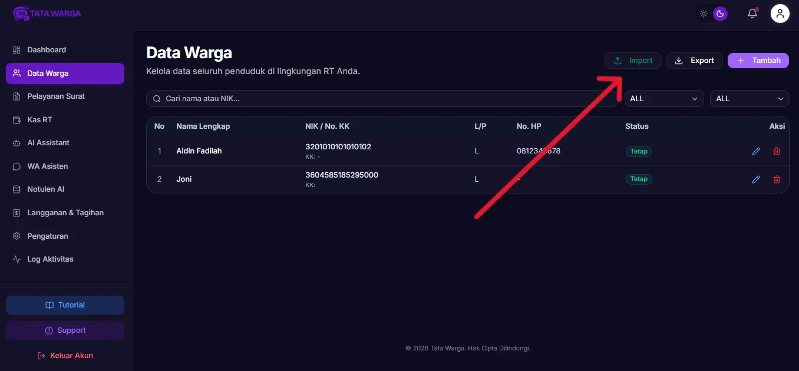
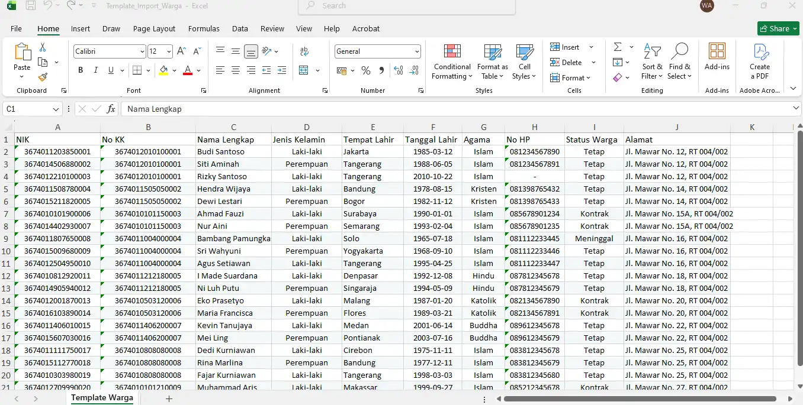

# Import Data Warga

Memasukkan data warga satu per satu tentu akan sangat melelahkan jika Anda memiliki ratusan hingga ribuan warga. Oleh karena itu, aplikasi Tata Warga menyediakan fitur **Import** menggunakan file Excel (.xlsx).

Fitur ini juga dirancang cerdas: **Jika Anda mengunggah NIK yang sudah ada di sistem, maka data lama akan diperbarui (*update*) otomatis.**

## Langkah-Langkah Import Data
Ikuti panduan berikut untuk mengimpor data warga secara massal:

### 1. Unduh Template Excel

Sangat penting untuk menggunakan template resmi agar sistem dapat membaca kolom data Anda dengan benar.
1. Masuk ke halaman **Data Warga** pada *Dashboard*.
2. Klik tombol **"Import"** (berwarna hijau) di bagian atas tabel.
3. Pada *pop-up* (dialog) yang muncul, klik tombol **"Download Template Excel"**.
4. Buka file bernama `Template_Import_Warga.xlsx` yang baru saja Anda unduh.

### 2. Mengisi Data pada Excel

Buka template tersebut menggunakan Microsoft Excel atau Google Sheets. Anda akan melihat beberapa kolom wajib dan opsional:
*   **NIK (Wajib):** 16 digit angka KTP.
*   **Nama Lengkap (Wajib):** Nama warga.
*   **No KK:** Nomor Kartu Keluarga.
*   **Jenis Kelamin:** Cukup ketik "L" atau "Laki-laki" untuk Pria, dan "P" atau "Perempuan" untuk Wanita.
*   **Tempat Lahir:**
*   **Tanggal Lahir:** (Format tanggal disarankan: YYYY-MM-DD).
*   **Agama**
*   **No HP**
*   **Status Warga:** (TETAP / KONTRAK_KOST / PINDAH / MENINGGAL). Jika dikosongkan, defaultnya adalah TETAP.
*   **Alamat**

> [!WARNING]
> Jangan mengubah nama *Header* (baris pertama) pada file Excel, karena sistem membacanya secara otomatis berdasarkan judul kolom tersebut. Jika sebuah sel tidak ada isinya, biarkan kosong. Jangan menghapus kolom.

### 3. Mengunggah File (Import)

Setelah Anda selesai mengisi data dan menyimpan file Excel tersebut:
1. Kembali ke halaman **Data Warga** di *Dashboard*.
2. Klik tombol **"Import"** kembali.
3. Klik tombol **"Pilih File & Import"**.
4. Pilih file Excel yang sudah Anda isi.
5. Tunggu prosesnya selesai. Sistem akan memberi tahu berapa banyak data yang berhasil dimasukkan atau diperbarui.

