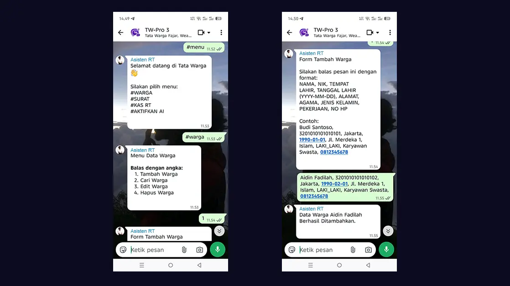

# Menambah & Mengedit Warga Lewat WhatsApp

Selain melalui *Dashboard* website, keunggulan utama aplikasi Tata Warga adalah kemampuannya terintegrasi langsung dengan Grup WhatsApp pengurus RT. Anda bisa menambah, mencari, mengedit, hingga menghapus data warga cukup lewat chat WA!

## Cara Menambah Warga via WhatsApp

1. Ketik **`#MENU`** atau **`#WARGA`** di dalam Grup WhatsApp pengurus yang sudah didaftarkan, atau kirim langsung ke nomor Bot Tata Warga.
2. Bot akan membalas dengan menampilkan Menu Warga. Balas dengan mengetik angka **`1`** (Tambah Warga).
3. Bot akan meminta Anda mengirimkan data warga dalam format yang dipisahkan oleh tanda koma.
4. Balas pesan tersebut dengan format urutan berikut:
   `NAMA, NIK, TEMPAT LAHIR, TANGGAL LAHIR (YYYY-MM-DD), ALAMAT, AGAMA, JENIS KELAMIN, PEKERJAAN, NO HP`
   
   **Contoh Balasan Anda:**
   > Budi Santoso, 3201010101010101, Jakarta, 1990-01-01, Jl. Merdeka 1, Islam, LAKI_LAKI, Karyawan Swasta, 0812345678

5. Jika format sudah benar, Bot akan membalas: *"Data Warga Budi Santoso Berhasil Ditambahkan."*

> [!TIP]
> **Tips Pintar:** Anda cukup *copy* contoh teks balasan dari Bot, lalu ubah nilainya. Pastikan tanda koma berjumlah 8 buah (memisahkan 9 isian).

## Cara Mengedit Warga via WhatsApp

Jika Anda ingin mengubah data warga (misalnya nomor HP atau pekerjaan baru), lakukan langkah berikut:
1. Panggil menu warga dengan mengetik **`#WARGA`**.
2. Balas dengan angka **`3`** (Edit Warga).
3. Bot akan meminta Anda memasukkan **NIK (16 Digit)** warga yang ingin diedit. Kirimkan NIK tersebut.
4. Bot akan menampilkan data warga saat ini dalam format yang dibatasi koma.
5. **Salin (Copy)** seluruh pesan terakhir dari Bot tersebut, kemudian tempel (*Paste*) di kolom ketik Anda.
6. **Ubah data yang perlu direvisi** secara langsung pada teks tersebut (jangan hapus tanda komanya).
7. **Kirim kembali**, dan data warga akan otomatis diperbarui di seluruh sistem!

## Fitur Pencarian & Penghapusan
*   **Cari Warga:** Balas menu dengan angka **`2`**, lalu masukkan NIK. Bot akan menampilkan detail data lengkap warga tersebut (Nama, Alamat, Agama, HP, Status).
*   **Hapus Warga:** Balas menu dengan angka **`4`**, lalu masukkan NIK. Jika NIK cocok, data akan dihapus dari sistem.

*Jika Anda ingin membatalkan proses yang sedang berjalan kapan saja, cukup ketik **`#BATAL`**.*
