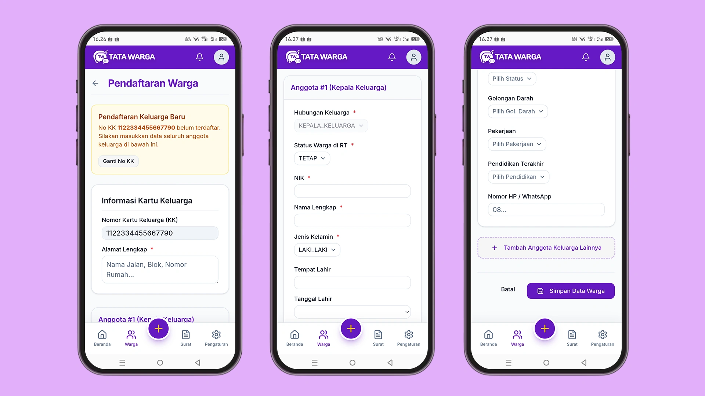

# Menambah & Mengedit Warga

Aplikasi Tata Warga menyediakan fitur Manajemen Data Warga yang lengkap untuk mempermudah Ketua RT atau Admin dalam melakukan pendataan kependudukan di lingkungan RT.

Anda dapat menambah warga baru atau mengedit data warga yang sudah ada langsung melalui *Aplikasi*.

## Mengakses Halaman Warga
1. Login ke akun Anda.
2. Klik tombol plus (*berada di posisi tengah*), pilih menu **Tambah Warga**.
3. Anda akan dibawa ke halaman **Pendaftaran Warga**.

## Cara Menambah Data Warga Baru

1. Di halaman ***Pendaftaran Warga**, masukan Nomor KK (Kartu Keluarga).
2. Jika No KK belum terdaftar, Anda akan diarahkan ke formulir penambahan data warga.
3. Isi formulir yang tersedia. Formulir ini terbagi menjadi 3 bagian utama:

### A. Informasi Kartu Keluarga
Bagian ini berisi nomor kartu keluarga:
*   **No KK (Nomor Kartu Keluarga):** Wajib diisi (maksimal 16 digit).
*   **Alamat Rumah** (Wajib diisi tanpa nama desa, kecamatan, dan kabupaten)

### B. Anggota #1 (Kepala Keluarga)
Bagian ini mendata identitias kepala keluarga:
*   **Hubungan Keluarga** Otomatis terisi sebagai kepala keluarga
*   **Status warga di RT**
*   **Tempat & Tanggal Lahir**
*   **NIK**
*   **Nama Lengkap**
*   **Jenis Kelamain**
*   **Tempat Lahir**
*   **Tanggal Lahir**
*   **Agama**
*   **Status Perkawinan**
*   **Golongan Darah**
*   **Pendidikan Terakhir**
*   **No Hp/Whatsapp**

### C. Tambah Anggota Keluarga Lainnya
Bagian ini memuat data anggota keluarga lainnya seperti istri, anak, dan lainnya:
*   **Hubungan Keluarga**
*   **Status warga di RT**
*   **Tempat & Tanggal Lahir**
*   **NIK**
*   **Nama Lengkap**
*   **Jenis Kelamain**
*   **Tempat Lahir**
*   **Tanggal Lahir**
*   **Agama**
*   **Status Perkawinan**
*   **Golongan Darah**
*   **Pendidikan Terakhir**
*   **No Hp/Whatsapp**

4. Setelah semua data terisi, klik tombol **"Simpan Data Warga"**.

## Cara Mengedit Data Warga

Jika ada perubahan data (misalnya warga pindah atau berganti nomor HP), Anda dapat mengeditnya dengan mudah:
1. Buka menu **Warga**.
2. Cari nama kepala keluarga atau No KK yang ingin diedit (Anda bisa menggunakan fitur pencarian).
3. Klik tombol **Detail**
4. Selain mengedit data warga, di halaman ini juga Anda bisa menambah anggota keluarga.
5. Klik daftar anggota yang ingin Anda edit/hapus
5. Klik tombol **"Simpan Data Warga"**.
