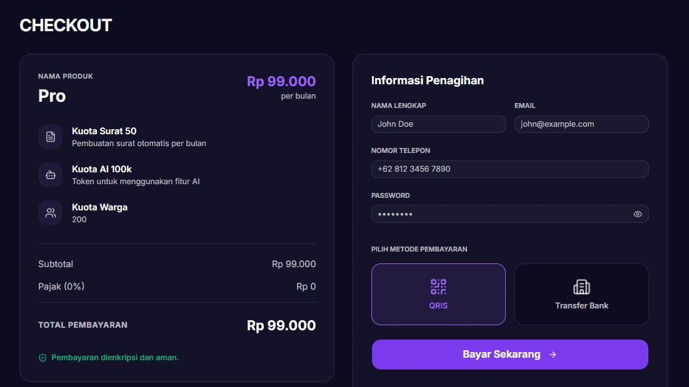

# Cara Mendaftar Tata Warga

#### Selamat datang di **Tata Warga!** Untuk mulai mendigitalisasi administrasi lingkungan Anda, silakan ikuti langkah-langkah pendaftaran berikut:

1. Akses menu Harga pada halaman utama website Tata Warga atau klik https://tatawarga.net/auth/register, lalu pilih paket langganan yang sesuai dengan kenutuhan Anda.
2. Anda akan diarahkan ke halaman *Checkout*
3. Isi formulir pendaftaran dengan data yang valid:
*   **Nama Lengkap** *(Admin/Ketua RT)*
*   **Email** *(Email ini sekaligus menjadi username login Anda nantinya)*
*   **Nomor Telepon** *(Pastikan menggunakan nomor WhatsApp aktif)*
*   **Password** *(Untuk login aplikasi)*

4. Pilih metode pembayaran
*   **QRIS:** Untuk pembayaran cepat menggunakan aplikasi dompet digital (GoPay, OVO, Dana) atau m-Banking.
*   **Transfer Bank:** Pembayaran menggunakan transfer manual.
5. Klik tombol**Bayar Sekarang**
6. Selesai