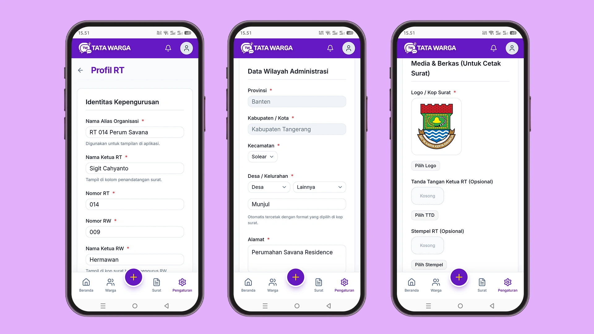

# Melengkapi Profil RT

Setelah berhasil membuat akun dan login, langkah pertama yang **wajib** Anda lakukan sebelum dapat mencetak surat atau menginput data warga adalah **Melengkapi Profil RT**. 

Data profil ini sangat penting karena akan digunakan secara otomatis oleh sistem untuk membuat Kop Surat resmi dan membubuhkan penandatangan pada setiap dokumen administrasi warga.

Untuk mulai melengkapi, navigasikan ke halaman menu **Pengaturan** di *Aplikasi* Anda.

## 1. Identitas Kepengurusan
Pada bagian ini, isi informasi dasar terkait struktur kepengurusan RT Anda:
*   **Nama Alias Organisasi:** Ketik nama yang akan tampil di aplikasi (Contoh: `RT 01 RW 09 Sukamaju`).
*   **Nama Ketua RT:** Nama lengkap Anda selaku ketua (akan tampil di kolom penandatangan surat).
*   **Nomor RT & Nomor RW:** (Contoh: `001` dan `009`).
*   **Nama Ketua RW:** Nama lengkap Ketua RW (akan tampil di kop surat).

## 2. Data Wilayah Administrasi
Pastikan data di bawah ini diisidengan lengkap agar **tercetak rapi di Kop Surat**.
*   **Provinsi**
*   **Kabupaten**
*   **Kecamatan**
*   **Desa / Kelurahan** (pilih desa Anda, jika tidak ada dalam daftar, ketik manual nama desa/kelurahan).
*   **Alamat:** Ketik alamat lengkap sekretariat RT (akan tampil di bagian bawah Kop Surat).

## 3. Media & Berkas (Untuk Cetak Surat)

Bagian ini mengatur estetika dan legalitas surat yang dicetak sistem.
*   **Logo / Kop Surat (Wajib):** Unggah logo perumahan atau logo RT Anda.
*   **Tanda Tangan Ketua RT (Opsional):** Unggah foto/scan tanda tangan asli Anda berlatar belakang transparan (PNG). Jika diunggah, surat warga akan secara otomatis dibubuhi tanda tangan ini (sehingga tidak perlu tanda tangan basah lagi).
*   **Stempel RT (Opsional):** Unggah scan stempel resmi RT Anda berlatar belakang transparan (PNG). Jika diunggah, surat warga akan secara otomatis dibubuhi stempel ini.

Setelah semua data terisi dengan benar dan berkas berhasil diunggah, klik tombol **"Simpan Pengaturan"**. 

Selamat! Profil kepengurusan RT Anda kini telah lengkap, dan aplikasi Tata Warga siap digunakan secara maksimal.
