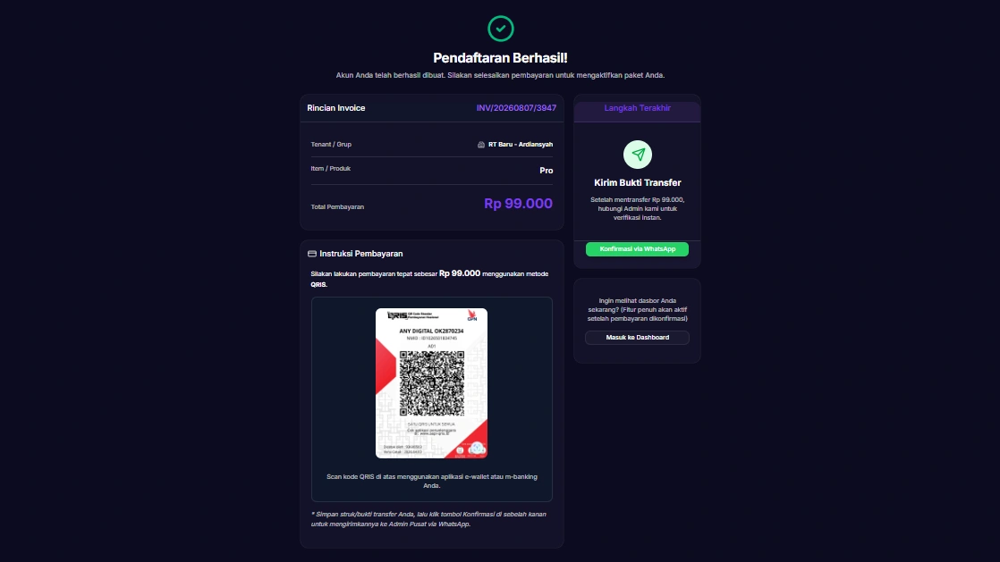

# Alur Proses Pembayaran

Proses pembayaran di Tata Warga terintegrasi langsung dengan pendaftaran (satu pintu). Hal ini bertujuan agar pengguna (Ketua RT/Admin) tidak perlu melakukan tahapan pendaftaran yang berbelit-belit.

Berikut adalah alur lengkap proses *checkout* dan pembayaran:

## Konfirmasi Pembayaran
Setelah mengklik tombol **"Bayar Sekarang"**, sistem akan memproses data Anda dalam hitungan detik. 
*   **Invoice Pembayaran:** Anda akan otomatis diarahkan ke halaman *Pendaftaran Berhasil* untuk menyelesaikan instruksi pembayaran (menampilkan QRIS atau nomo rekening untuk transfer manual).
*   **Proses Pembayaran:** Kirimkan pembayaran sesuai nominal yang tertera pada invoice ke rekening resmi.
*   **Konfirmasi:** Ambil tangkapan layar (screenshot) bukti transfer, lalu lakukan konfirmasi ke WhatsApp Admin.

## Verifikasi
*   **Invoice Pembayaran:** Admin akan mengecek bukti pembayaran. Jika sesuai, akun akan di acc dan aktif langsung bisa digunakan.

> **Catatan Keamanan:** Semua informasi transaksi dan pembayaran di aplikasi Tata Warga telah terenkripsi dan dijamin keamanannya.
