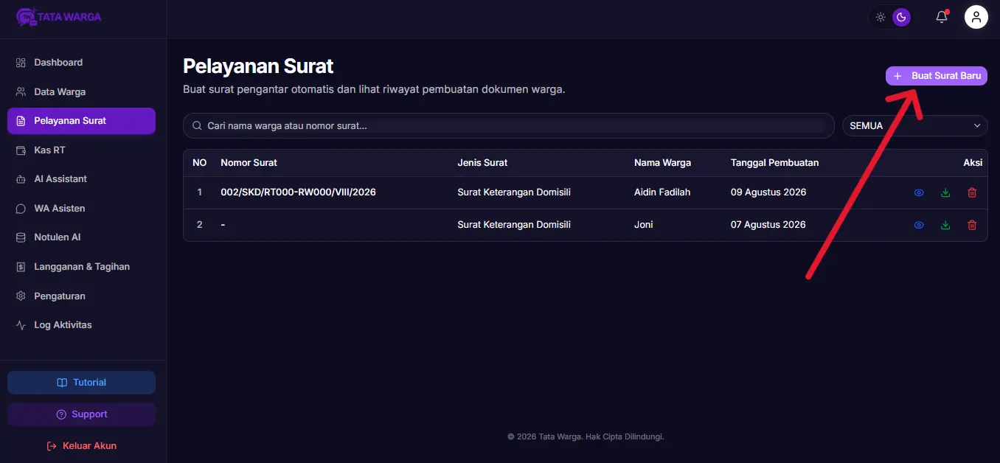
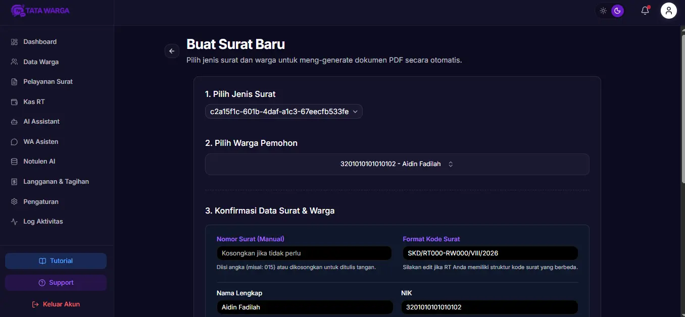
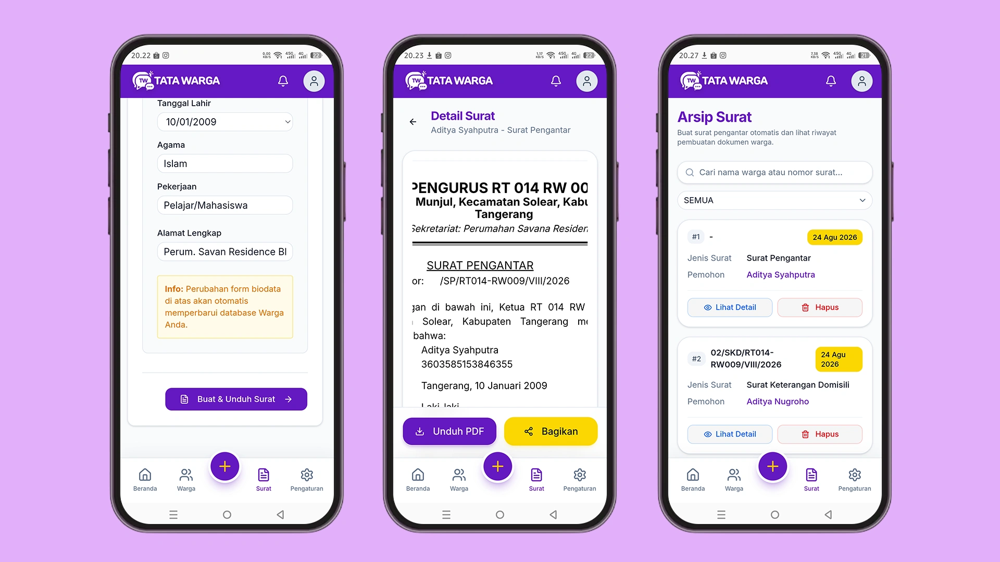

# Membuat Surat

Aplikasi Tata Warga membuat proses pembuatan surat administrasi menjadi sangat cepat dan terotomatisasi. Anda tidak perlu lagi repot mengetik ulang data warga atau mengatur margin di Microsoft Word.

Seluruh surat yang dibuat melalui fitur ini akan otomatis tersimpan ke dalam **Arsip Surat**, memudahkan Anda untuk melacak riwayat pelayanan warga.

## Langkah Pembuatan Surat

1. Di halaman Beranda, pilih menu **Surat**.
2. Kemudian klik tombol menu **Plus**.
3. Pilih menu **Buat Surat**
4. Anda akan dihadapkan pada halaman pembuatan surat yang terdiri dari 3 tahapan (*step*).

### Tahap 1: Pilih Jenis Surat
Pilih jenis *Template* surat yang ingin Anda buat pada *dropdown* yang tersedia (Misalnya: Surat Pengantar, Surat Keterangan Domisili, atau Surat Keterangan Usaha).

### Tahap 2: Pilih Warga Pemohon
Ketik nama atau **NIK** warga yang meminta surat tersebut pada kolom pencarian. Jika warga tersebut sudah didaftarkan pada menu *Data Warga*, namanya akan otomatis muncul dan bisa Anda pilih.

### Tahap 3: Konfirmasi Data Surat & Warga
Setelah memilih jenis surat dan warga, formulir bagian ketiga akan otomatis terbuka. Formulir ini sangat cerdas karena:

*   **Form Isian Khusus (Dinamis):** Jika Anda membuat surat yang memerlukan keterangan khusus (misalnya "Surat KPengantar"), sistem akan memunculkan kolom input "Keperluan".
*   **Nomor & Kode Surat:** Sistem telah merancang format *Kode Surat* standar secara otomatis (berisi kode template, wilayah RT/RW, bulan romawi, dan tahun). Anda bisa mengubahnya jika diperlukan. *Nomor Surat* dapat dikosongkan jika Anda ingin menulisnya secara manual (tulis tangan) usai di cetak.
*   **Edit Cepat Data Warga:** Data warga akan terisi otomatis. Menariknya, jika ada kesalahan data diri (seperti Alamat atau Pekerjaan), Anda bisa mengubahnya langsung di sini. Perubahan ini akan otomatis memperbarui database profil warga tersebut!

## Mengunduh & Mencetak

* Setelah semua data sudah Anda pastikan benar, klik tombol biru **"Buat & Unduh Surat"** di bagian paling bawah.

* Sistem akan langsung memproses data tersebut, menempelkan *Kop Surat*, *Tanda Tangan*, dan *Stempel* (jika sudah Anda unggah di Profil RT), kemudian langsung **mengunduh (download) dokumen surat dalam format PDF**. 

* Surat yang diunduh tersebut kini sudah siap cetak atau siap kirim ke warga bersangkutan!

* Surat yang sudha pernah dibuat juga akan tersimpan otomatis di menu **Arsip Surat**
