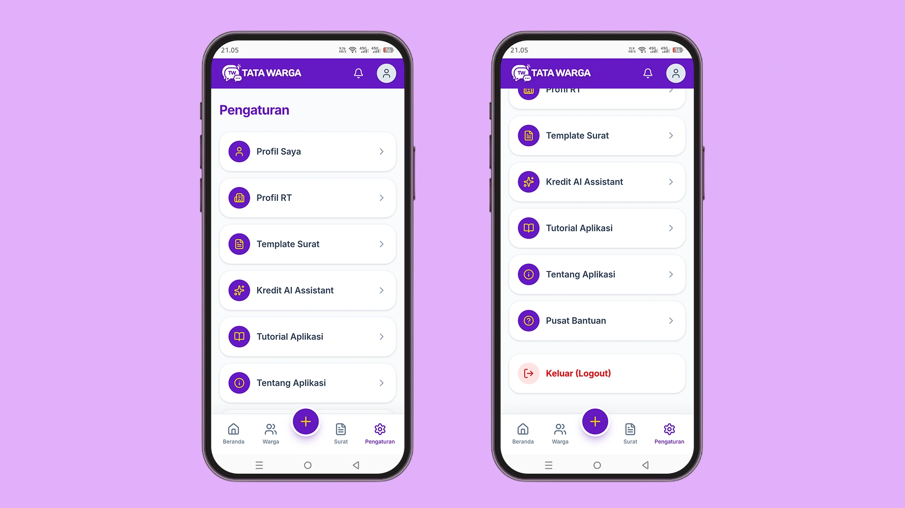

# Mengenal Menu Pengaturan

## Berikut Penjelasan Menu Pengaturan

👤 **Profil Saya:** Menu ini digunakan untuk mengelola data akun pribadi Anda sebagai Ketua RT atau Admin. Di sini Anda biasanya bisa mengubah nama lengkap, email, password, atau foto profil pribadi.

🏢 **Profil RT:** Berfungsi untuk mengatur identitas lingkungan ke-RT-an Anda. Ini mencakup pengaturan nama lingkungan, alamat, logo RT, susunan pengurus, atau informasi publik lainnya yang berkaitan dengan wilayah Anda.

📄 **Template Surat:** Tempat Anda merancang dan menyesuaikan format blangko surat (seperti Surat Pengantar, Surat Keterangan Domisili, dll) yang nantinya akan mempermudah dan mempercepat proses pelayanan administrasi warga.

✨ **Kredit AI Assistant:** Menu ini adalah panel kontrol untuk memantau sisa saldo (kredit/token) penggunaan Kecerdasan Buatan (AI) Anda. Anda bisa mengecek berapa banyak kuota yang tersisa untuk fitur Chat AI Warga maupun fitur pembuat Notulen Rapat otomatis.

📖 **Tutorial Aplikasi:** Berupa tautan (link) pintasan yang akan langsung mengarahkan Anda ke halaman panduan resmi (docs.tatawarga.web.id). Sangat berguna jika Anda atau pengurus lain ingin mempelajari cara memakai fitur tertentu.

ℹ️ **Tentang Aplikasi:** Menampilkan profil sistem Tata Warga, seperti versi aplikasi, kebijakan privasi, syarat dan ketentuan, serta penjelasan singkat mengenai tujuan aplikasi ini dibuat.

💬 **Pusat Bantuan:** Tombol respons cepat (quick action) yang akan langsung mengalihkan Anda ke WhatsApp. Fungsinya agar Anda bisa segera mengobrol dengan tim Support / Admin Teknis jika menemukan kendala.

🚪 **Keluar Akun (Logout):** Tombol berwarna merah di urutan paling bawah untuk mengakhiri sesi (Sign Out) dan keluar dari aplikasi secara aman.